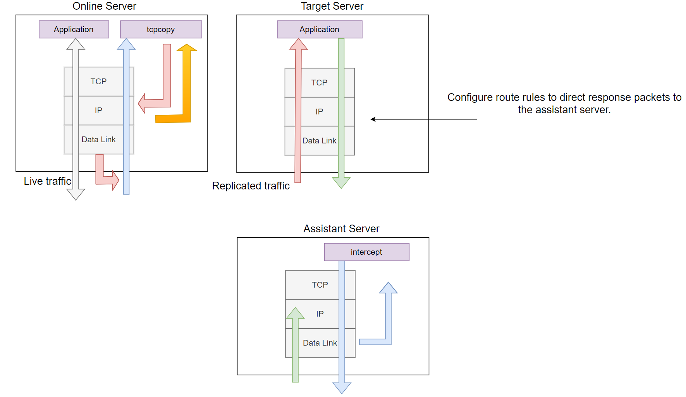

# [TCPCopy](https://github.com/session-replay-tools/tcpcopy) - A TCP Stream Replay Tool

TCPCopy is a TCP stream replay tool for realistic testing of Internet server applications. 

## Getting to Know TCPCopy

[An Overview of TCPCopy for Beginners](doc/Beginners.md)

[A General Overview of TCPCopy Architecture](doc/Architecture.md)

[TCPCopy Testing Use Cases](doc/Usage.md)

[TCPCopy Pre-Warming Examples](doc/Pre-Warming.md)

## Description

Although real live traffic is crucial for testing Internet server applications, accurately simulating it is challenging due to the complexity of online environments. To enable more realistic testing, TCPCopy was developed as a live flow reproduction tool that generates test workloads closely resembling production workloads. TCPCopy is widely used by companies in China.

TCPCopy minimally impacts the production system, consuming only additional CPU, memory, and bandwidth. The reproduced workload mirrors the production environment in terms of request diversity, network latency, and resource usage.

## Use Cases

* Distributed Stress Testing
  - Use TCPCopy to replicate real-world traffic for stress testing your server software, uncovering bugs that only appear under high-stress conditions.
* Live Testing
  - Validate the stability of new systems and identify bugs that only manifest in real-world scenarios
* Regression testing
  - Ensure that recent changes have not introduced new issues.
* Performance comparison
  - Compare system performance across different versions or configurations.

## Architecture

Figure 1. Overview of the TCPCopy Architecture.

As shown in Figure 1, TCPCopy is composed of two components: `tcpcopy` and `intercept`. The `tcpcopy` component runs on the online server, capturing live requests, while `intercept` operates on the assistant server, performing tasks such as passing response information to `tcpcopy`. The test application itself runs on the target server.

By default, `tcpcopy` uses raw sockets to capture packets at the network layer (depicted by the orange arrows in the figure). It handles processes such as TCP interaction simulation, network latency control, and upper-layer interaction simulation. It then sends packets to the target server using raw sockets for output (shown by the light red arrows in the figure).

The only required task on the target server is configuring route rules to direct response packets (shown by light green arrows in the figure) to the assistant server.

The `intercept` component's role is to forward the response header (by default) to `tcpcopy`. It captures the response packets, extracts the response header information, and sends this information to `tcpcopy` via a dedicated channel (represented by light blue arrows in the figure). Upon receiving the response header, `tcpcopy` uses the information to modify the attributes of online packets and proceeds to send subsequent packets.

It is important to note that responses from the target server are routed to the assistant server, which functions as a black hole.

## Quick Start

For `intercept`, you have two options:

* [Download the latest intercept release](https://github.com/session-replay-tools/intercept/releases).
* Clone the repository:
  `git clone git://github.com/session-replay-tools/intercept.git`.

For `tcpcopy`, you also have two options

* [Download the latest tcpcopy release](https://github.com/session-replay-tools/tcpcopy/releases).
* Clone the repository:
  `git clone git://github.com/session-replay-tools/tcpcopy.git`.

## Installing intercept on the Assistant Server

1. Navigate to the `intercept` directory: 
   `cd intercept`
2. Run the configuration script: 
   `./configure`  
   Optionally, specify any necessary configuration options.
3. Compile the source code: 
   `make`
4. Install the `intercept` tool: 
   `make install`

### Configure Options for `intercept`

- `--single`  
  Run `intercept` in non-distributed mode.

- `--with-pfring=PATH`  
  Specify the path to the PF_RING library sources.

- `--with-debug`  
  Compile `intercept` with debug support, with logs saved to a file.

## Installing `tcpcopy` on the Online Server

1. Navigate to the `tcpcopy` directory:  
   `cd tcpcopy`
2. Run the configuration script:  
   `./configure`  
    Include any necessary configuration options as needed.
3. Compile the source code:  
   `make`
4. Install the `tcpcopy` tool:  
   `make install`

### Configure Options for `tcpcopy`

- `--offline`  
  Replay TCP streams from a pcap file.

- `--pcap-capture`  
  Capture packets at the data link layer.

- `--pcap-send`  
  Send packets at the data link layer instead of the IP layer.

- `--with-pfring=PATH`  
  Specify the path to the PF_RING library sources.

- `--set-protocol-module=PATH`  
  Set `tcpcopy` to work with an external protocol module.

- `--single`  
  If both `intercept` and `tcpcopy` are configured with the `--single` option, only one `tcpcopy` instance will work with `intercept`, leading to better performance.

- `--with-tcmalloc`  
  Use tcmalloc instead of malloc.

- `--with-debug`  
  Compile `tcpcopy` with debug support, with logs saved to a file.

## Running TCPCopy

Assume that both `tcpcopy` and `intercept` are configured using `./configure`.

1. **On the Target Server Running Server Applications:**
   
   Configure the route rules to direct response packets to the assistant server. For example, if `61.135.233.161` is the IP address of the assistant server, use the following route command to direct all responses from clients in the `62.135.200.x` range to the assistant server:
   
   `route add -net 62.135.200.0 netmask 255.255.255.0 gw 61.135.233.161`

2. **On the Assistant Server Running `intercept` (Root Privilege or CAP_NET_RAW Capability Required):**
   
    `./intercept -F <filter> -i <device>`
   
   Note that the filter format is the same as the pcap filter. For example:
   
   `./intercept -i eth0 -F 'tcp and src port 8080' -d`
   
   In this example, `intercept` will capture response packets from a TCP-based application listening on port 8080, using the eth0 network device.
   
   Please note that `ip_forward` is not enabled on the assistant server.

3. **On the Online Source Server (Root Privilege or CAP_NET_RAW Capability Required):**
   
   `./tcpcopy -x localServerPort-targetServerIP:targetServerPort -s <intercept server> [-c <ip range>]`
   
   For example (assuming 61.135.233.160 is the IP address of the target server):
   
   `./tcpcopy -x 80-61.135.233.160:8080 -s 61.135.233.161 -c 62.135.200.x`
   
   In this example, `tcpcopy` captures packets on port 80 from the current server, changes the client IP address to one from the 62.135.200.x range, and sends these packets to port 8080 on the target server (61.135.233.160). It also connects to 61.135.233.161 to request `intercept` to forward response packets. While the `-c parameter` is optional, it is used here to simplify route rules.

## Note

1. Platform: Tested only on Linux (kernel 2.6 or above).
2. Packet Loss: TCPCopy may lose packets, which could result in lost requests.
3. Permissions: Requires root privilege or the `CAP_NET_RAW` capability (e.g., setcap CAP_NET_RAW=ep tcpcopy).
4. Connection Type: Currently supports only client-initiated connections.
5. SSL/TLS: Does not support replay for applications using SSL/TLS.
6. Due to the additional layer of forwarding in tcpcopy, the throughput of a single application connection cannot be too high; otherwise, it won't match the native connection throughput, especially in performance tests like sysbench or ab.
7. If the volume of replicated requests is too large, tcpcopy may become unstable, with the single thread overwhelmed by packet capture, significantly reducing replication effectiveness. In such cases, other auxiliary methods can be used, such as leveraging switch mirroring with a divide-and-conquer packet capture strategy or using offline replay.
8. MySQL Session Replay: For details, visit [mysql-replay-module](https://github.com/session-replay-tools/mysql-replay-module) or [mysql-sgt-replay-module](https://github.com/session-replay-tools/mysql-sgt-replay-module).
9. The `./configure --with-resp-payload` option for `intercept` cannot be used together with the `./configure` option for `tcpcopy`.
10. IP Forwarding: Ensure `ip_forward` is not enabled on the assistant server.
11. Help: For more information, run `./tcpcopy -h` or `./intercept -h`.

## Influential Factors

Several factors can impact TCPCopy, as detailed in the following sections.

### 1. Capture Interface

By default, `tcpcopy` uses a raw socket input interface to capture packets at the network layer on the online server. Under high load, the system kernel may drop some packets.
If configured with `--pcap-capture`, `tcpcopy` captures packets at the data link layer and can filter packets in the kernel. Using `PF_RING` with pcap capturing can reduce packet loss.
For optimal capture, consider mirroring ingress packets via a switch and distributing the traffic across multiple machines with a load balancer.

### 2. Sending Interface

`tcpcopy` defaults to using a raw socket output interface to send packets at the network layer to the target server. To avoid `ip_conntrack` issues or improve performance, use `--pcap-send` to send packets at the data link layer instead.

### 3. On the Way to the Target Server

Packets sent by `tcpcopy` may face challenges before reaching the target server. If the source IP address is the end-user's IP (by default), security devices may drop the packet as invalid or forged. To test this, use `tcpdump` on the target server. If packets are successfully sent within the same network segment but not across segments, packets may be dropped midway.

To address this, deploy `tcpcopy`, target applications, and `intercept` within the same network segment. Alternatively, use a proxy in the same segment to forward packets to the target server in another segment.

Deploying the target server’s application on a virtual machine within the same segment may still encounter these issues.

### 4. OS of the Target Server

The target server might use `rpfilter` to verify the legitimacy of source IP addresses, dropping packets deemed forged. If packets are captured by `tcpdump` but not processed, check `rpfilter` settings and adjust or remove them as needed. Other issues like `iptables` settings may also affect `tcpcopy`.

### 5. Applications on the Target Server

Applications on the target server may not process all requests promptly. Bugs or limitations in the application can lead to delayed responses or unprocessed requests in the socket buffer.

### 6. OS of the Assistant Server

Ensure that `ip_forward` is set to false on the assistant server to prevent it from routing packets and ensure it functions as a black hole.

## Logical Analysis of the Issue Where the Test Server Fails to Receive Data

First, use `telnet` on the online server to connect to the test server's port. This will check if the network path is accessible. If the connection fails, resolve this issue before proceeding with the following diagnostics.

Assume that during the `tcpcopy` test, the application on the test server does not receive any requests. Determine if the initial handshake packet (i.e., the SYN packet) reaches the test server.

### 1. **If the SYN packet reaches the test server, the following scenarios are possible:**

   **1.1 Only SYN Packets Captured:**
   If you use `tcpdump` on the test server and see that the replicated SYN packets are arriving, it indicates that they have reached the data link layer of the test server. If `netstat` shows no connections for the application, it means the packets were dropped at the IP layer. Check if `rpfilter` is configured—if so, remove this setting, and the issue should generally be resolved. If `rpfilter` is not set, confirm that there are no conflicts in the `iptables` settings and adjust the relevant rules if necessary.

   **1.2 SYN Followed by RST Packet:**
   If the SYN packet is immediately followed by a reset (RST) packet (with less than 1 second between them in the same session), it indicates a routing issue or conflict, causing the response packet to be sent directly back to the real client.

  **1.3 Test Server Responds with the Second Handshake Packet:**
   Capture packets on the assistant server to check if the second handshake packet has reached it.

- **If the packet hasn't reached the assistant server,** it suggests that the routing setup is not effective, and therefore `intercept` cannot capture the second handshake packet, preventing further replay. A potential solution is to run `intercept` directly on the test server (note: keep the routing setup unchanged, and ensure that the `-c` parameter in `tcpcopy` is not set to the IP address used by `tcpcopy` to connect to `intercept`, or else `tcpcopy` won’t connect to `intercept`).

- **If the second handshake packet is captured,** check if `ip_forward` is enabled. If it is, disable this setting, as it may cause the response packets to be sent directly back to the client, interfering with the test.

### 2. **If the SYN packet does not reach the test server, there are two possible scenarios:**

   **2.1 `tcpcopy` Packets Captured on the Online Server:**
   If you capture `tcpcopy`'s forwarded packets using `tcpdump` on the online server, but the packets do not reach the test server, it indicates that they were dropped along the way. You can try using the `-c` parameter in `tcpcopy` to modify the client IP address to a valid one. In extreme cases, set the client IP to the IP address of the machine running `tcpcopy` (note: NAT issues may arise, and if `intercept` is running on the test server, ensure the `-c` parameter in `tcpcopy` is not set to the IP address used by `tcpcopy` to connect to `intercept`, or else `tcpcopy` won’t connect to `intercept`).

   **2.2 `tcpcopy` Packets Not Captured on the Online Server:**

- **If no `all clt:xx` information is found in `tcpcopy`'s log,** it indicates that `tcpcopy` is unable to capture packets at the IP layer. In this case, use the `--pcap-capture` option to capture packets at the data link layer. Set the `-F` parameter (e.g., 'tcp and dst port 80 and dst host 10.100.1.2') and the `-i` parameter (network interface) to bypass IP layer capturing.

- **If `all clt:xx`, where `xx > 0`, is seen in `tcpcopy`'s log,** it means `tcpcopy` successfully captured the packet, but it was filtered out by the IP layer on the online server. Check `iptables` restrictions on the output chain, among other settings. If `iptables` is the problem and cannot be modified on the online server, use the `--pcap-send` option to send packets from the data link layer.

## Release History

+ 2014.09  v1.0    TCPCopy released
+ 2024.09  v1.0    Open source fully uses English

## Bugs and Feature Requests

Have a bug or a feature request? [Please open a new issue](https://github.com/session-replay-tools/tcpcopy/issues). Before opening any issue, please search for existing issues.

## Copyright and License

Copyright 2024 under [the BSD license](LICENSE).

## Acknowledgments

Several individuals have been crucial in the writing of this document by reviewing drafts and offering feedback. I am especially grateful for the contributions of Hongshen Wang. 
