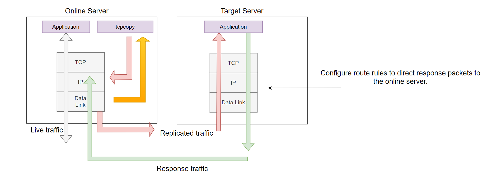
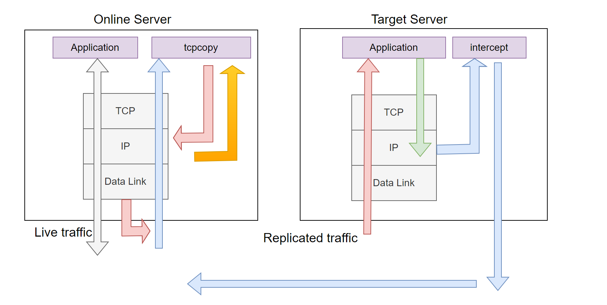

## A General Overview of TCPCopy Architecture

In the field of server-based request replay, there are generally two main approaches: offline replay and real-time online replication. Researchers often focus on offline replay, with little exploration in real-time replication. Based on feedback from SIGCOMM reviewers, there seems to be minimal research in real-time request replication.

For real-time request replication, there are generally two types:

- Application-layer request replication
- Packet-level request replication

Traditional approaches often replicate requests at the application layer, as seen in tools like Oracle Database Replay. Although easier to implement, this approach has several drawbacks:

- Replicating requests from the application layer requires traversing the entire protocol stack, which can consume resources, such as valuable connection resources.
- Testing becomes coupled with the actual application, increasing the potential impact on online systems. Server-based replication, for instance, can cause request processing times to depend on the slowest request (e.g., `max(actual request time, replicated request time)`).
- Supporting high-stress replication is difficult and may severely impact online systems, according to feedback from some users.
- Network latency is challenging to control.

Packet-level request replication, however, can avoid traversing the entire protocol stack. The shortest path can capture and send packets directly from the data link layer, or alternatively, at the IP layer. As long as TCP is not involved, the impact on online systems is significantly reduced.

Taking a packet-based approach, server-side request replication is indeed a promising direction with significant potential. Unfortunately, the creator of `tcpreplay` only briefly explored this path with `flowreplay` before abandoning it. From what I’ve seen, this area remains under-researched (most studies instead focus on entire networks; even SIGCOMM reviewers haven't suggested similar research approaches).

## Diving into TCPCopy’s Architectural Evolution

The TCPCopy architecture has gone through three generations. The core principle remains the same: leveraging online packet data to simulate a TCP client stack and deceive the test application service on the target server. Since TCP interactions are inherently bidirectional, it is typically necessary to know the target server's response packets to construct a suitable request packet for the test application. Thus, regardless of the implementation, capturing response packets is essential unless the TCP protocol is drastically altered.

The three architectures differ primarily in where response packets are intercepted.

## The First Architecture

The earliest TCPCopy architecture was as follows:

Figure 1. Initial TCPCopy Architecture Diagram.

As shown above, `tcpcopy` captured request packets from the data link layer (via `pcap`) and sent packets from the IP layer. The target server's TCP stack received no interference from mechanisms like `ip queue` or `nfqueue`, and response packets would directly return to the online server(through routing settings). `tcpcopy` could capture these response packets at the data link layer, with packets typically being discarded at the IP layer (unless the client IP was the IP of the online server itself, in which case the packets would reach the TCP layer but be reset by TCP).

Special thanks to TCPCopy’s originator, Wang Bo, who pioneered this initial exploration. Designed and implemented in 2009, this original 300-line version supported the early development of NetEase’s ad delivery system, achieving zero deployment errors and resolving hundreds of issues pre-launch. 

Returning to the architecture, this early version generally functioned only within the same network segment. For web applications, it was mostly limited to single-machine traffic, lacking the depth required to fully uncover potential issues or explore the broader capabilities of NetEase’s ad delivery system.

### Summary of the First Architecture

**Advantages:**  

- Simple and direct
- Suitable for smoke testing
- Relatively realistic testing outcomes

**Disadvantages:**  

- Higher impact on the online environment due to response packets returning to the online server (though still less than application-layer replication).  
- Network segment limitations.  
- For web applications, it is challenging to utilize multiple live flows, which limits its value for stress testing.  
- Internal applications are heavily restricted because the client IP of requests cannot match the replicated online server’s IP address.

## The Second Architecture

This architecture was initially designed by TCPCopy’s originator Wang Bo (designed in 2010 and handed over to me in June 2011). The general architecture is outlined below:

Figure 2. The Second TCPCopy Architecture Diagram.

As shown in the diagram, `tcpcopy` now captures packets from the IP layer and also sends packets from the IP layer. Unlike the first architecture, this design intercepts response packets at the target server, with the intercept program returning the necessary response packet information to `tcpcopy`. This approach enables distributed load testing, which greatly advanced TCPCopy’s evolution compared to the first architecture.

To analyze the interception of response packets, in theory, we could capture response packets at the IP layer or data link layer on the target server. Let’s examine these options:

- Capturing at the data link layer: If no routing is configured, the response packet would return to the actual client initiating the request, which would affect the client’s TCP module (frequent resets) and, under high load, could cause unnecessary interference to the switch, router, and even the entire network.

- Capturing at the IP layer: The netlink technology offers a solution to the above issues. Netlink is a communication method for interaction between user-space processes and the kernel. Specifically, we can use kernel modules such as ip_queue (for kernel versions below 3.5) or nfqueue (for kernel 3.5 or above) to capture response packets.

We chose the second method, which captures response packets at the IP layer. Once a response packet is passed to `intercept`, we can retrieve the essential response packet information (generally TCP/IP header information) and transmit it to `tcpcopy`. We can also use a verdict to instruct the kernel on handling these response packets. If there is no whitelist setting, these response packets will be dropped at the IP layer, making them undetectable by tcpdump (which operates at the data link layer).

This design allows for the replication of traffic from multiple online servers onto a single target server. Within `intercept`, routing information is retained to determine which tcpcopy instance to return the response packet information. However, `intercept` does consume resources on the target server, and ip_queue or nfqueue may not perform efficiently, particularly for high-stress tests or short-connection load testing, leading to significant challenges.

### Summary of this architecture

**Advantages:**

- Supports replicating traffic from multiple online servers
- Minimizes impact on online servers, typically only returning TCP/IP header information

**Disadvantages:**

- More complex than the first architecture
- Performance limits are often tied to ip_queue or nfqueue
- `intercept` lacks scalability, restricted by ip_queue and nfqueue’s inability to support multi-process response packet capture
- `intercept` affects the final test results on the target server, especially under high-stress conditions
- Incomplete testing on the target server (no coverage of data link layer egress)
- Less convenient for maintenance

## The Third Architecture

The following diagram illustrates the latest architecture, designed specifically for extreme testing. This setup offloads `intercept` from the target server and places it on a separate, dedicated assistant server (preferably an idle server on the same network segment). In this setup, response packets are captured at the data link layer instead of the IP layer, significantly reducing interference with the target machine (aside from routing configuration) and greatly enhancing the ability to capture response packets. Consequently, this architecture provides a more realistic testing environment.

Figure 3. The Third TCPCopy Architecture Diagram.

### Detailed Overview

Routing information is configured on the target server, where the application to be tested routes the necessary response packets to the assistant server. On the assistant server, we capture the response packets at the data link layer, extract useful information, and return it to the corresponding tcpcopy instance.

To achieve high efficiency, this architecture recommends using pcap for packet capture, allowing filtering to be handled in the kernel space. Without pcap, filtering would only be possible in user space. Filtering can be configured on either the `intercept` or `tcpcopy` side (using the `-F` parameter, similar to `tcpdump` filters), enabling packet capture to be handled in a divide-and-conquer approach across multiple instances. This design improves scalability and is ideal for handling extremely high concurrency.

This architecture requires more machine resources and is more challenging to use, as it involves knowledge of TCP, routing, and pcap filters (similar to` tcpdump` filtering conditions). Therefore, this architecture requires users to be familiar with the above knowledge.

It’s important to note that in certain scenarios, pcap packet capture may experience higher packet loss rates than raw socket capture. Therefore, it’s advisable to use pf_ring for support or switch to raw socket capture.

### Summary

**Advantages:**

- Provides a more realistic testing environment
- Highly scalable
- Suitable for high concurrency scenarios
- Avoids the limitations of ip_queue and nfqueue
- Virtually no performance impact on the target server
- Easier maintenance on the target server running services
- Will not crash alongside the service-running server in the event of a failure

**Disadvantages:**

- More challenging to operate
- Requires additional machine resources
- Demands more knowledge
- The assistant server (running `intercept`) should ideally be on the same network segment as the target server to simplify deployment

All three architectures have their merits. Currently, only the second and third architectures are open-source, and tcpcopy defaults to the third architecture. 

Finally, to minimize or eliminate the impact on the online environment when replicating requests, consider using the following approach:

- Use a high-performance bypass mechanism (if using mirroring, modify the destination address of client data packets) to replicate request data packets to a separate system. In this separate system, apply the third architecture to capture requests via the pcap interface and then forward them to the test application on the target server.
